# 肤联智诊系统实现图与数据库说明

> 说明  
> 本文基于当前正式实现整理，主要依据如下：
> - `backend/app/model.py`
> - `backend/app/routes/auth.py`
> - `backend/app/routes/consultation.py`
> - `backend/app/routes/user.py`
> - `backend/app/routes/doctor.py`
> - `backend/app/routes/admin.py`
> - `backend/app/routes/chat.py`
> - `backend/app/service.py`
> - `sql/01_schema.sql`
> - `sql/migrations/20260429_doctor_admin_productization.sql`
>
> 当前正式使用的核心数据库表共 `19` 张，均来自 `sql/01_schema.sql`。  
> `sql/03_seed_business.sql` 中存在旧知识库扩展表 `knowledge_documents`、`knowledge_chunks_metadata`、`qa_records`，它们不在当前 ORM 模型和 `01_schema.sql` 中，因此本文将其作为“遗留/可选表”单独说明，不纳入当前正式 ER 主图。

## 1. 系统实现概览

### 1.1 系统组成

| 层级 | 实现方式 | 说明 |
| --- | --- | --- |
| 用户端 | `uni-app + Vue 3 + TypeScript` | 面向普通用户，支持 H5 和微信小程序，提供登录、问诊、分析结果、历史、健康档案、知识问答等功能 |
| 医生端 | `Vue 3 + Vite + TypeScript + Pinia + Element Plus` | 面向医生，提供工作台、问诊管理、患者档案、AI 反馈 |
| 管理端 | `Vue 3 + Vite + TypeScript + Pinia + Element Plus` | 面向管理员，提供控制台、用户管理、医生管理、咨询记录、系统配置、日志监控 |
| 后端 | `FastAPI + SQLAlchemy + JWT` | 负责认证鉴权、问诊流转、AI 分析、配置管理、日志留痕 |
| 数据库 | `MySQL` | 保存账户、档案、问诊、AI 结果、通知、日志、统计等数据 |
| AI 服务 | `VisualAnalyzer` | 图文问诊支持真实模型与本地 mock/fallback；文本问答支持路由、直接回答、联网搜索 |
| 文件服务 | `/uploads` 静态目录 | 存储用户上传图片并通过 URL 回传前端 |

### 1.2 当前核心业务闭环

1. 用户注册/登录并完善个人资料、健康档案。
2. 用户上传皮肤图片并提交图文问诊。
3. 系统自动创建问诊单、分配医生、执行 AI 图文分析。
4. 用户查看 AI 分析结果；高风险或需要复核的病例进入医生处理队列。
5. 医生查看病例详情、患者档案，提交专业回复并可对 AI 结果进行反馈。
6. 用户查看医生回复、历史记录、通知消息。
7. 管理员查看平台控制台，对医生、用户、咨询、系统配置、日志进行监管。

### 1.3 关键状态

#### 问诊状态 `consultations.status`

| 状态值 | 含义 |
| --- | --- |
| `PENDING_AI` | 用户刚提交，等待 AI 分析 |
| `AI_DONE` | AI 分析完成，且当前无需医生复核 |
| `WAIT_DOCTOR` | 等待医生处理 |
| `DOCTOR_REPLIED` | 医生已回复 |
| `CLOSED` | 问诊已结束 |

#### 医生审核状态 `doctors.audit_status`

| 状态值 | 含义 |
| --- | --- |
| `PENDING` | 待审核 |
| `APPROVED` | 审核通过 |
| `REJECTED` | 审核驳回 |

#### 医生 AI 反馈状态 `doctor_ai_feedbacks.ai_accuracy`

| 状态值 | 含义 |
| --- | --- |
| `ACCURATE` | AI 判断基本准确 |
| `PARTIAL` | AI 部分准确 |
| `INACCURATE` | AI 判断不准确 |

## 2. 各个端主要功能

### 2.1 用户端主要功能

| 模块 | 主要功能 |
| --- | --- |
| 登录页 | 登录、注册、短信验证码发送、忘记密码重置 |
| 首页 | 查看个人摘要、当前关注病例、最近问诊记录、快捷入口 |
| 图文问诊 | 上传 1-5 张图片、填写主诉/病程/瘙痒/疼痛/扩散情况、提交问诊 |
| 分析结果 | 查看 AI 图像观察、可能病情方向、风险等级、护理建议、医生回复 |
| 历史记录 | 查看问诊记录、问答记录、删除历史 |
| 健康档案 | 查看近 30/90 天风险趋势、护理建议、最近病例 |
| 个人中心 | 修改头像、基本资料、健康信息、密码 |
| 文本问答 | 创建会话、发送消息、查看历史消息、删除会话 |
| 通知消息 | 查看问诊受理、医生回复、问诊关闭等提醒 |

### 2.2 医生端主要功能

| 模块 | 主要功能 |
| --- | --- |
| 工作台 | 查看待处理问诊数量、高风险数量、今日处理量、AI 反馈准确率 |
| 问诊管理 | 按状态/风险/关键词筛选问诊；查看详情；查看患者档案；提交回复；保存 AI 反馈 |
| 患者档案 | 查看基础资料、健康档案、历史病例、风险趋势、长期护理建议、建议复查病例 |

### 2.3 管理端主要功能

| 模块 | 主要功能 |
| --- | --- |
| 控制台 | 查看平台指标、咨询趋势、系统运行指标、待审核医生、重点告警、医生处理概览 |
| 用户管理 | 查看普通用户、搜索过滤、启用/停用账号、查看最近咨询和健康档案 |
| 医生管理 | 查看医生列表、审核资质、切换服务状态、查看医生统计与最近咨询 |
| 咨询记录 | 查看全平台问诊详情、AI 结果、医生回复、时间线；异常标记；归档；关闭；软删除 |
| 系统配置 | 管理 AI 参数、提示词、风险规则、上传规则、通知规则、权限矩阵 |
| 日志监控 | 查看登录日志、操作日志、AI 调用日志、异常告警、趋势概览 |

## 3. 用例图

> 说明  
> Mermaid 目前没有标准 UML 用例图语法，下面使用 `flowchart` 近似表达“参与者 - 用例”关系。  
> 如果你要在论文里画标准用例图，可以直接按下面的参与者和用例名称绘制椭圆图。

### 3.1 用户端用例图

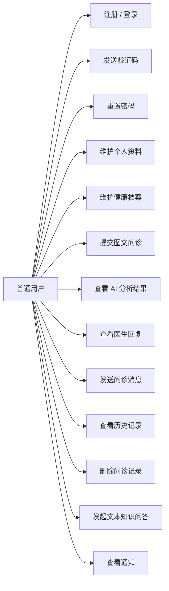

### 3.2 医生端用例图

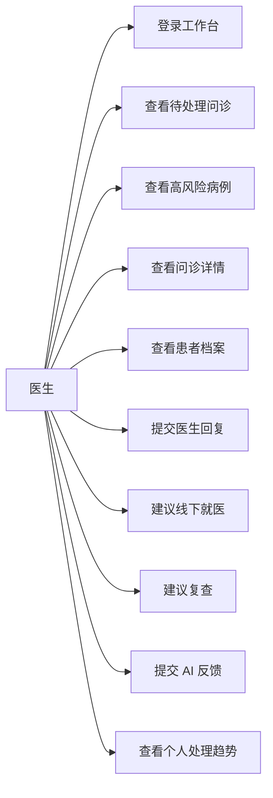

### 3.3 管理端用例图

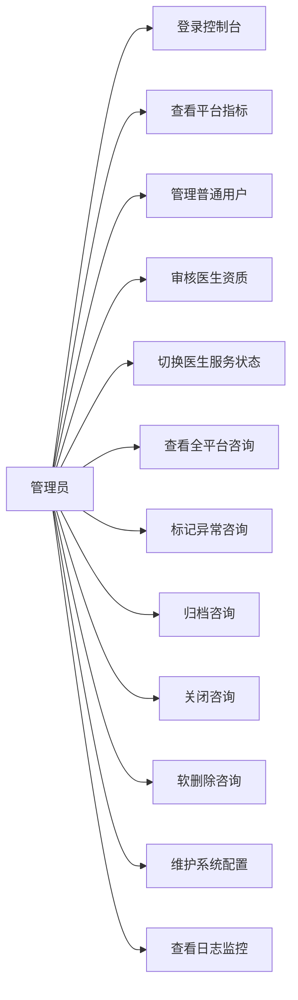

### 3.4 系统整体参与者关系图

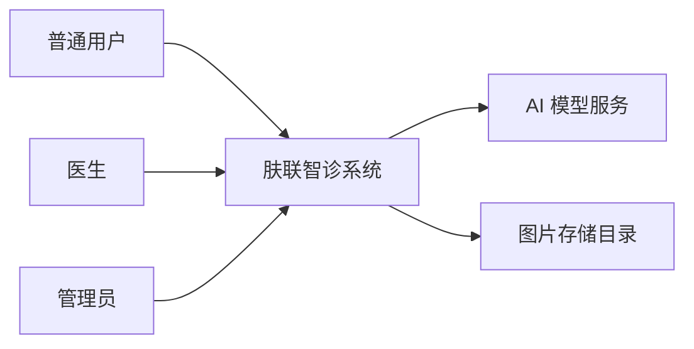

## 4. 用例说明

### 4.1 用户端用例说明

| 用例名称 | 参与者 | 前置条件 | 主要成功场景 | 结果 |
| --- | --- | --- | --- | --- |
| 注册账号 | 普通用户 | 未登录，手机号可用 | 输入手机号、验证码、密码并提交 | 创建 `users`、`user_profiles`，返回登录态所需资料 |
| 登录系统 | 普通用户 | 已存在有效账号 | 输入手机号/用户名和密码，系统校验后签发 JWT | 用户进入问诊系统 |
| 重置密码 | 普通用户 | 手机号已注册 | 获取验证码、填写新密码、校验验证码 | 更新 `users.password_hash` |
| 维护个人资料 | 普通用户 | 已登录 | 修改姓名、性别、年龄、城市、头像、紧急联系人等 | 更新 `user_profiles` 与 `users.avatar_url` |
| 维护健康档案 | 普通用户 | 已登录 | 填写过敏史、既往史、用药史、肤质、作息饮食等 | 更新 `health_profiles` |
| 提交图文问诊 | 普通用户 | 已登录，已上传至少 1 张图片 | 上传图片、填写症状信息、提交问诊 | 创建 `consultations`、`consultation_images`、`consultation_messages`，触发 AI 分析 |
| 查看 AI 结果 | 普通用户 | 已有问诊单 | 打开分析结果页查看 AI 观察、风险、护理建议 | 读取 `ai_analysis_records` 最新结果 |
| 查看医生回复 | 普通用户 | 医生已处理问诊 | 进入问诊详情查看医生意见 | 读取 `consultation_replies` |
| 历史记录管理 | 普通用户 | 已存在问诊/问答历史 | 查看、筛选、删除历史记录 | 软删除问诊，或删除问答会话 |
| 发起文本问答 | 普通用户 | 已登录 | 创建会话、发送问题、查看回答与来源 | 写入 `chat_sessions`、`chat_messages`、`tool_call_logs` |

### 4.2 医生端用例说明

| 用例名称 | 参与者 | 前置条件 | 主要成功场景 | 结果 |
| --- | --- | --- | --- | --- |
| 登录工作台 | 医生 | 医生账号可用 | 输入账号密码，系统校验角色和状态 | 进入医生端工作台 |
| 查看工作台 | 医生 | 已登录 | 查看待处理队列、焦点病例、高风险提醒、趋势 | 聚合返回工作台数据 |
| 查看问诊详情 | 医生 | 问诊已分配给当前医生 | 打开详情页查看图片、症状、患者信息、AI 分析、时间线 | 获取完整病例上下文 |
| 提交医生回复 | 医生 | 问诊属于当前医生 | 填写初步意见、护理建议、是否线下就医、是否复查、医生备注 | 写入/更新 `consultation_replies`，同步 `consultation_messages`，问诊状态改为 `DOCTOR_REPLIED` |
| 提交 AI 反馈 | 医生 | 已查看 AI 分析结果 | 选择准确度并填写修正意见、知识缺口备注 | 写入 `doctor_ai_feedbacks` |
| 查看患者档案 | 医生 | 患者与当前医生存在已分配问诊关系 | 查看基础信息、健康信息、历史病例、风险趋势、长期护理建议 | 支持连续管理与随访 |

### 4.3 管理端用例说明

| 用例名称 | 参与者 | 前置条件 | 主要成功场景 | 结果 |
| --- | --- | --- | --- | --- |
| 查看控制台 | 管理员 | 已登录 | 查看平台总用户数、医生数、咨询总数、高风险咨询、运行状态、趋势 | 获得平台运营概况 |
| 管理普通用户 | 管理员 | 已登录 | 搜索用户、查看详情、启用/停用账号 | 更新 `users.status` |
| 审核医生资质 | 管理员 | 已登录，存在待审核医生 | 审核医生信息，决定通过或驳回 | 更新 `doctors.audit_status`、`audit_remark`、`service_status` |
| 管理医生服务状态 | 管理员 | 已登录，医生已存在 | 暂停服务或恢复服务 | 更新 `doctors.service_status` |
| 管理咨询记录 | 管理员 | 已登录，存在问诊单 | 查询、查看详情、关闭咨询、异常标记、归档、删除 | 更新 `consultations` 对应字段 |
| 更新系统配置 | 管理员 | 已登录 | 修改模型参数、提示词、上传规则等 | 更新 `system_configs` |
| 监控日志 | 管理员 | 已登录 | 查看登录、操作、AI 调用、异常告警等日志 | 读取 `operation_logs`、`ai_analysis_records` |

## 5. 关键流程图

### 5.1 用户注册 / 登录流程

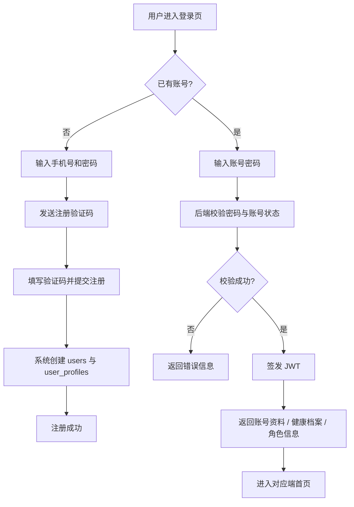

### 5.2 用户提交图文问诊流程

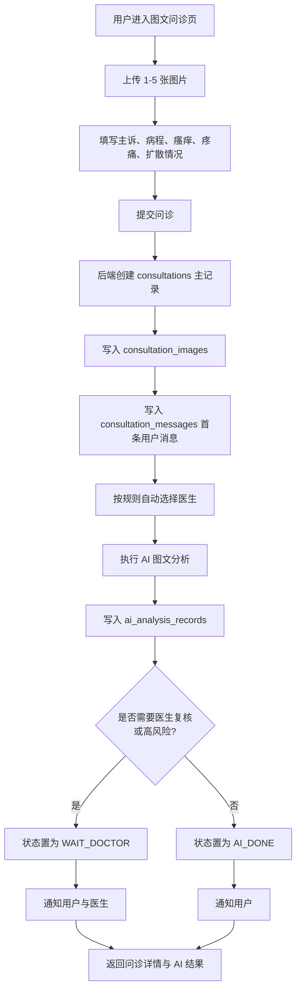

### 5.3 AI 分析与状态流转流程

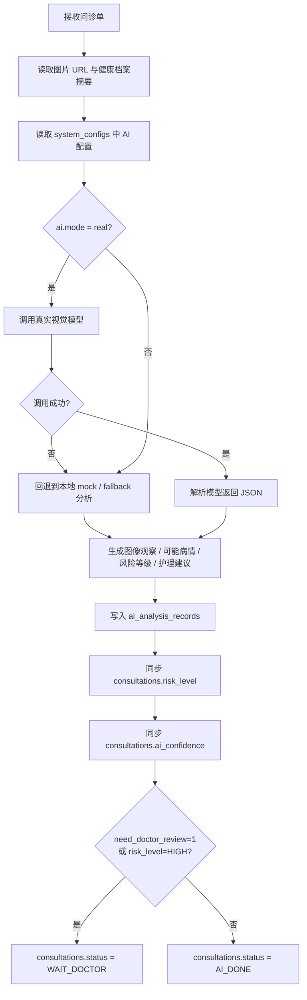

### 5.4 用户查看结果与历史流程

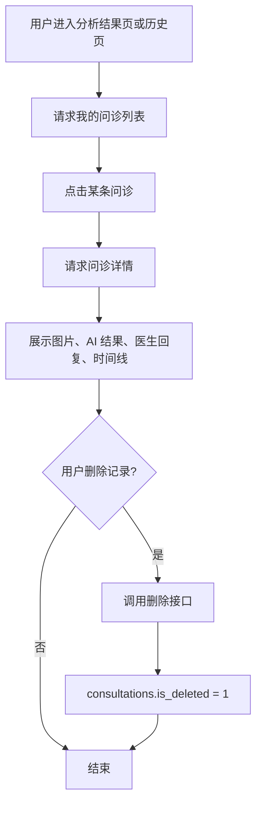

### 5.5 用户知识问答流程

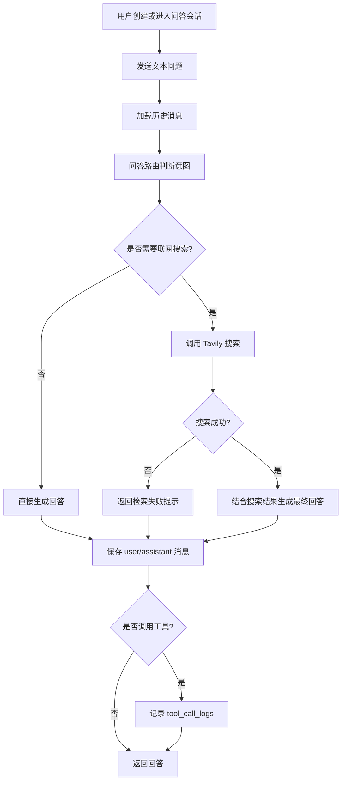

### 5.6 医生工作台分诊流程

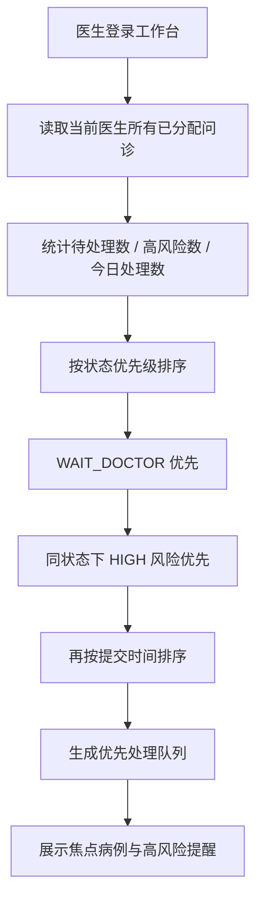

### 5.7 医生处理问诊与反馈 AI 流程

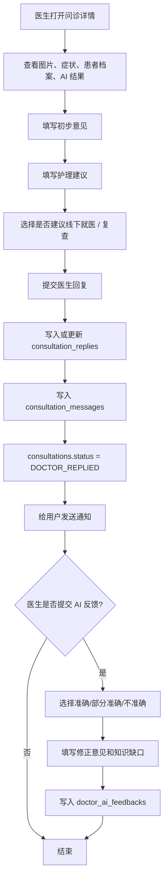

### 5.8 医生查看患者档案流程

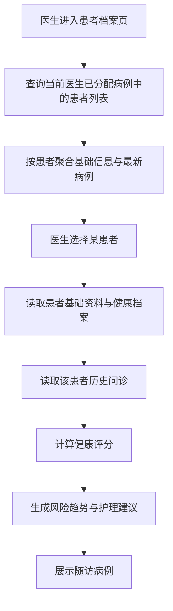

### 5.9 管理员审核医生流程

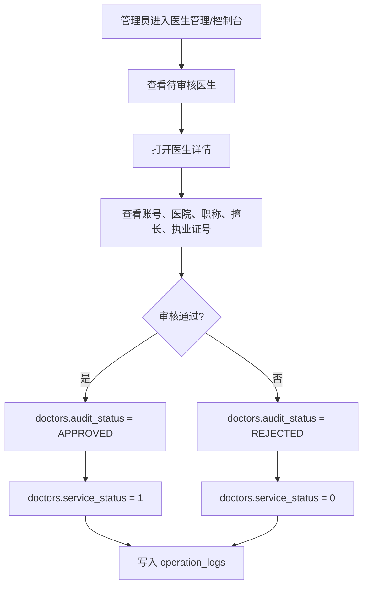

### 5.10 管理员咨询监管流程

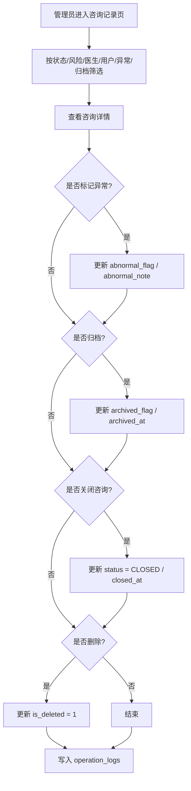

### 5.11 管理员系统配置流程

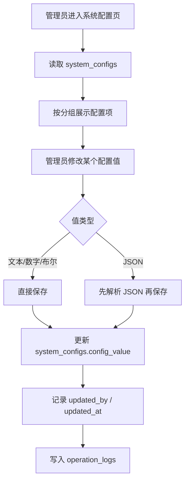

### 5.12 管理员日志监控流程

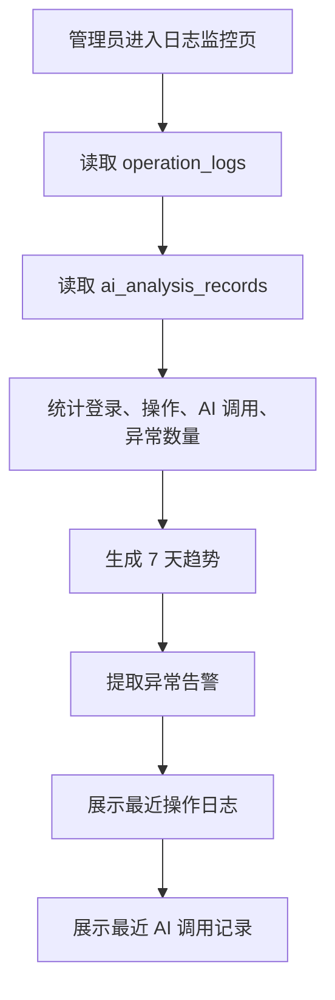

## 6. 数据库图与 E-R 图说明

### 6.1 当前正式实现的数据库表分类

#### 账户与身份类

- `users`
- `user_profiles`
- `health_profiles`
- `doctors`
- `admins`

#### 问诊业务类

- `consultations`
- `consultation_images`
- `ai_analysis_records`
- `consultation_messages`
- `consultation_replies`
- `doctor_ai_feedbacks`
- `notifications`

#### 文本问答类

- `chat_sessions`
- `chat_messages`
- `tool_call_logs`

#### 运营与配置类

- `system_configs`
- `announcements`
- `operation_logs`
- `statistics_snapshots`

### 6.2 关键数据表

| 关键表 | 原因 |
| --- | --- |
| `users` | 所有角色账户总表，是权限和身份的核心入口 |
| `user_profiles` | 存储普通用户/角色的基础资料，是画像主表 |
| `health_profiles` | 存储健康档案，是 AI 分析和医生判断的重要上下文 |
| `doctors` | 存储医生资质与服务状态，决定自动分配和审核流程 |
| `consultations` | 问诊主表，是整个业务闭环的核心枢纽 |
| `ai_analysis_records` | 记录每次 AI 分析结果与失败信息，是 AI 模块核心表 |
| `consultation_replies` | 记录医生正式答复，是用户看到的专业意见主体 |
| `doctor_ai_feedbacks` | 记录医生对 AI 的质量反馈，是模型优化闭环关键表 |
| `system_configs` | 控制 AI 参数、提示词、上传规则、权限矩阵等 |
| `operation_logs` | 记录关键操作，是监管、审计、日志监控核心表 |

### 6.3 表之间的关系清单

| 主表 | 从表 | 关系 | 说明 |
| --- | --- | --- | --- |
| `users.id` | `user_profiles.user_id` | 1:1 | 一个账号对应一条基础档案 |
| `user_profiles.id` | `health_profiles.user_profile_id` | 1:0..1 | 一个基础档案可对应一条健康档案 |
| `users.id` | `doctors.user_id` | 1:0..1 | 一个医生账号对应一条医生业务资料 |
| `users.id` | `admins.user_id` | 1:0..1 | 一个管理员账号对应一条管理员业务资料 |
| `users.id` | `consultations.user_id` | 1:N | 一个用户可发起多次问诊 |
| `doctors.id` | `consultations.assigned_doctor_id` | 1:N | 一个医生可被分配多条问诊 |
| `consultations.id` | `consultation_images.consultation_id` | 1:N | 一次问诊可上传多张图片 |
| `consultations.id` | `ai_analysis_records.consultation_id` | 1:N | 一次问诊可有多次 AI 分析记录 |
| `consultations.id` | `consultation_messages.consultation_id` | 1:N | 一次问诊可有多条沟通消息 |
| `consultations.id` | `consultation_replies.consultation_id` | 1:N | 一次问诊理论上可有多次医生回复版本 |
| `doctors.id` | `consultation_replies.doctor_id` | 1:N | 一个医生可回复多条问诊 |
| `consultations.id` | `doctor_ai_feedbacks.consultation_id` | 1:N | 一次问诊可有多次 AI 反馈记录 |
| `doctors.id` | `doctor_ai_feedbacks.doctor_id` | 1:N | 一个医生可提交多次 AI 反馈 |
| `users.id` | `chat_sessions.user_id` | 1:N | 一个用户可创建多个问答会话 |
| `chat_sessions.id` | `chat_messages.session_id` | 1:N | 一个会话可包含多条消息 |
| `users.id` | `chat_messages.user_id` | 1:N | 消息归属某个用户 |
| `chat_sessions.id` | `tool_call_logs.session_id` | 1:N | 一个会话可能触发多次工具调用 |
| `chat_messages.id` | `tool_call_logs.message_id` | 1:N | 一条助手消息可对应一个或多个工具调用日志 |
| `users.id` | `system_configs.updated_by` | 1:N | 谁修改了配置 |
| `users.id` | `announcements.published_by` | 1:N | 谁发布了公告 |
| `users.id` | `notifications.user_id` | 1:N | 一个用户可收到多条通知 |
| `users.id` | `operation_logs.account_id` | 1:N | 一个账号对应多条操作日志 |

### 6.4 当前正式 E-R 图（Mermaid）

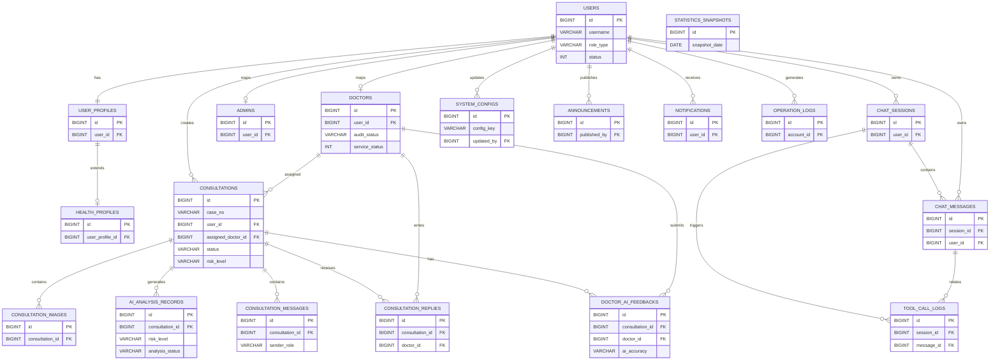

## 7. 所有数据库表字段说明

### 7.1 账户与身份类表

#### 7.1.1 `users`

| 字段名称 | 类型 | 说明 |
| --- | --- | --- |
| `id` | `BIGINT` | 账户主键 |
| `username` | `VARCHAR(50)` | 登录账号名，当前用户端通常使用手机号登录 |
| `password_hash` | `VARCHAR(255)` | 密码哈希值 |
| `role_type` | `VARCHAR(20)` | 角色类型，取值如 `USER`、`DOCTOR`、`ADMIN` |
| `phone` | `VARCHAR(20)` | 手机号 |
| `email` | `VARCHAR(100)` | 邮箱 |
| `avatar_url` | `VARCHAR(500)` | 头像地址 |
| `status` | `INT` | 账号状态，`1` 启用，`0` 停用 |
| `last_login_at` | `DATETIME` | 最近登录时间 |
| `created_at` | `DATETIME` | 创建时间 |
| `updated_at` | `DATETIME` | 更新时间 |
| `is_deleted` | `INT` | 软删除标记，`0` 未删除，`1` 已删除 |

#### 7.1.2 `user_profiles`

| 字段名称 | 类型 | 说明 |
| --- | --- | --- |
| `id` | `BIGINT` | 用户档案主键 |
| `user_id` | `BIGINT` | 关联 `users.id`，一对一 |
| `real_name` | `VARCHAR(50)` | 真实姓名 |
| `gender` | `VARCHAR(10)` | 性别 |
| `age` | `INT` | 年龄 |
| `birthday` | `DATE` | 出生日期 |
| `city` | `VARCHAR(50)` | 所在城市 |
| `occupation` | `VARCHAR(50)` | 职业 |
| `emergency_contact` | `VARCHAR(50)` | 紧急联系人 |
| `emergency_phone` | `VARCHAR(20)` | 紧急联系电话 |
| `remark` | `VARCHAR(255)` | 备注说明 |
| `created_at` | `DATETIME` | 创建时间 |
| `updated_at` | `DATETIME` | 更新时间 |

#### 7.1.3 `health_profiles`

| 字段名称 | 类型 | 说明 |
| --- | --- | --- |
| `id` | `BIGINT` | 健康档案主键 |
| `user_profile_id` | `BIGINT` | 关联 `user_profiles.id`，一对一 |
| `allergy_history` | `TEXT` | 过敏史 |
| `past_medical_history` | `TEXT` | 既往病史 |
| `medication_history` | `TEXT` | 用药史 |
| `skin_type` | `VARCHAR(50)` | 肤质类型 |
| `skin_sensitivity` | `VARCHAR(50)` | 皮肤敏感程度 |
| `sleep_pattern` | `VARCHAR(50)` | 睡眠习惯 |
| `diet_preference` | `VARCHAR(80)` | 饮食习惯或偏好 |
| `special_notes` | `TEXT` | 特殊备注 |
| `updated_at` | `DATETIME` | 更新时间 |

#### 7.1.4 `doctors`

| 字段名称 | 类型 | 说明 |
| --- | --- | --- |
| `id` | `BIGINT` | 医生业务主键 |
| `user_id` | `BIGINT` | 关联 `users.id`，一对一 |
| `doctor_name` | `VARCHAR(50)` | 医生姓名 |
| `department` | `VARCHAR(50)` | 科室 |
| `title_name` | `VARCHAR(50)` | 职称 |
| `hospital_name` | `VARCHAR(100)` | 所属医院 |
| `specialty` | `VARCHAR(255)` | 擅长方向 |
| `intro` | `TEXT` | 简介 |
| `license_no` | `VARCHAR(100)` | 执业证号 |
| `audit_status` | `VARCHAR(20)` | 审核状态 |
| `audit_remark` | `VARCHAR(255)` | 审核备注 |
| `service_status` | `INT` | 服务状态，`1` 服务中，`0` 暂停 |
| `created_at` | `DATETIME` | 创建时间 |
| `updated_at` | `DATETIME` | 更新时间 |

#### 7.1.5 `admins`

| 字段名称 | 类型 | 说明 |
| --- | --- | --- |
| `id` | `BIGINT` | 管理员业务主键 |
| `user_id` | `BIGINT` | 关联 `users.id`，一对一 |
| `admin_name` | `VARCHAR(50)` | 管理员姓名 |
| `job_title` | `VARCHAR(50)` | 岗位名称 |
| `permissions_summary` | `VARCHAR(255)` | 权限摘要 |
| `created_at` | `DATETIME` | 创建时间 |
| `updated_at` | `DATETIME` | 更新时间 |

### 7.2 问诊业务类表

#### 7.2.1 `consultations`

| 字段名称 | 类型 | 说明 |
| --- | --- | --- |
| `id` | `BIGINT` | 问诊主键 |
| `case_no` | `VARCHAR(50)` | 问诊单号 |
| `user_id` | `BIGINT` | 发起问诊的用户 |
| `assigned_doctor_id` | `BIGINT` | 分配的医生 |
| `summary_title` | `VARCHAR(120)` | 摘要标题 |
| `chief_complaint` | `TEXT` | 主诉描述 |
| `onset_duration` | `VARCHAR(50)` | 发病时长 |
| `itch_level` | `INT` | 瘙痒等级 |
| `pain_level` | `INT` | 疼痛等级 |
| `spread_flag` | `INT` | 是否存在扩散，`1` 是，`0` 否 |
| `status` | `VARCHAR(30)` | 问诊状态 |
| `risk_level` | `VARCHAR(20)` | 风险等级 |
| `ai_enabled` | `INT` | 是否启用 AI 分析 |
| `need_doctor_review` | `INT` | 是否需要医生复核 |
| `ai_confidence` | `FLOAT` | AI 结果置信度估计 |
| `abnormal_flag` | `INT` | 是否被管理员标记异常 |
| `abnormal_note` | `TEXT` | 异常标记说明 |
| `archived_flag` | `INT` | 是否归档 |
| `archived_at` | `DATETIME` | 归档时间 |
| `submitted_at` | `DATETIME` | 提交时间 |
| `closed_at` | `DATETIME` | 关闭时间 |
| `created_at` | `DATETIME` | 创建时间 |
| `updated_at` | `DATETIME` | 更新时间 |
| `is_deleted` | `INT` | 软删除标记 |

#### 7.2.2 `consultation_images`

| 字段名称 | 类型 | 说明 |
| --- | --- | --- |
| `id` | `BIGINT` | 问诊图片主键 |
| `consultation_id` | `BIGINT` | 关联问诊单 |
| `file_name` | `VARCHAR(255)` | 原始文件名或展示文件名 |
| `file_url` | `VARCHAR(2048)` | 图片访问地址 |
| `file_size` | `BIGINT` | 文件大小 |
| `file_type` | `VARCHAR(50)` | 文件类型 |
| `sort_no` | `INT` | 图片排序号 |
| `uploaded_at` | `DATETIME` | 上传时间 |

#### 7.2.3 `ai_analysis_records`

| 字段名称 | 类型 | 说明 |
| --- | --- | --- |
| `id` | `BIGINT` | AI 分析记录主键 |
| `consultation_id` | `BIGINT` | 关联问诊单 |
| `model_name` | `VARCHAR(100)` | 使用的模型名称 |
| `prompt_version` | `VARCHAR(50)` | 提示词版本 |
| `input_summary` | `TEXT` | 输入摘要 |
| `image_observation` | `TEXT` | 图像观察结果 |
| `possible_conditions` | `TEXT` | 可能病情方向 |
| `risk_level` | `VARCHAR(20)` | 风险等级 |
| `care_advice` | `TEXT` | 护理建议 |
| `hospital_advice` | `TEXT` | 线下就医建议 |
| `high_risk_alert` | `TEXT` | 高风险提醒 |
| `disclaimer` | `VARCHAR(255)` | 医疗免责声明 |
| `raw_response` | `TEXT` | 模型原始返回内容 |
| `analysis_status` | `VARCHAR(20)` | 分析状态，如成功、回退等 |
| `fail_reason` | `VARCHAR(255)` | 失败或回退原因 |
| `created_at` | `DATETIME` | 生成时间 |

#### 7.2.4 `consultation_messages`

| 字段名称 | 类型 | 说明 |
| --- | --- | --- |
| `id` | `BIGINT` | 问诊沟通消息主键 |
| `consultation_id` | `BIGINT` | 关联问诊单 |
| `sender_role` | `VARCHAR(20)` | 发送方角色 |
| `sender_id` | `BIGINT` | 发送方账号 ID |
| `message_type` | `VARCHAR(20)` | 消息类型，当前默认 `TEXT` |
| `content` | `TEXT` | 消息内容 |
| `created_at` | `DATETIME` | 发送时间 |

#### 7.2.5 `consultation_replies`

| 字段名称 | 类型 | 说明 |
| --- | --- | --- |
| `id` | `BIGINT` | 医生回复主键 |
| `consultation_id` | `BIGINT` | 关联问诊单 |
| `doctor_id` | `BIGINT` | 回复医生 |
| `content` | `TEXT` | 医生回复整合内容 |
| `first_impression` | `TEXT` | 初步诊断意见/第一印象 |
| `care_advice` | `TEXT` | 护理建议 |
| `suggest_offline_visit` | `INT` | 是否建议线下就医 |
| `suggest_follow_up` | `INT` | 是否建议复查 |
| `doctor_remark` | `TEXT` | 医生备注 |
| `created_at` | `DATETIME` | 创建时间 |
| `updated_at` | `DATETIME` | 更新时间 |

#### 7.2.6 `notifications`

| 字段名称 | 类型 | 说明 |
| --- | --- | --- |
| `id` | `BIGINT` | 通知主键 |
| `user_id` | `BIGINT` | 接收通知的用户 |
| `title` | `VARCHAR(120)` | 通知标题 |
| `content` | `TEXT` | 通知内容 |
| `notification_type` | `VARCHAR(30)` | 通知类型，如 `SYSTEM`、`CONSULTATION` |
| `related_business_type` | `VARCHAR(30)` | 关联业务类型 |
| `related_business_id` | `BIGINT` | 关联业务主键 |
| `read_flag` | `INT` | 是否已读 |
| `created_at` | `DATETIME` | 创建时间 |

#### 7.2.7 `doctor_ai_feedbacks`

| 字段名称 | 类型 | 说明 |
| --- | --- | --- |
| `id` | `BIGINT` | 医生 AI 反馈主键 |
| `consultation_id` | `BIGINT` | 关联问诊单 |
| `doctor_id` | `BIGINT` | 反馈医生 |
| `ai_accuracy` | `VARCHAR(20)` | AI 准确度评价 |
| `correction_note` | `TEXT` | 修正意见 |
| `knowledge_gap_note` | `TEXT` | 知识缺口说明 |
| `created_at` | `DATETIME` | 创建时间 |

### 7.3 文本问答类表

#### 7.3.1 `chat_sessions`

| 字段名称 | 类型 | 说明 |
| --- | --- | --- |
| `id` | `BIGINT` | 问答会话主键 |
| `user_id` | `BIGINT` | 会话所属用户 |
| `title` | `VARCHAR(120)` | 会话标题 |
| `created_at` | `DATETIME` | 创建时间 |
| `updated_at` | `DATETIME` | 更新时间 |

#### 7.3.2 `chat_messages`

| 字段名称 | 类型 | 说明 |
| --- | --- | --- |
| `id` | `BIGINT` | 问答消息主键 |
| `session_id` | `BIGINT` | 所属会话 |
| `user_id` | `BIGINT` | 所属用户 |
| `role` | `VARCHAR(20)` | 消息角色，如 `user`、`assistant` |
| `content` | `TEXT` | 消息内容 |
| `intent` | `VARCHAR(30)` | 识别意图 |
| `used_tool` | `INT` | 是否调用工具 |
| `tool_name` | `VARCHAR(50)` | 调用的工具名称 |
| `sources_json` | `TEXT` | 来源列表 JSON |
| `model_name` | `VARCHAR(100)` | 使用的文本模型名称 |
| `created_at` | `DATETIME` | 创建时间 |

#### 7.3.3 `tool_call_logs`

| 字段名称 | 类型 | 说明 |
| --- | --- | --- |
| `id` | `BIGINT` | 工具调用日志主键 |
| `session_id` | `BIGINT` | 所属会话 |
| `message_id` | `BIGINT` | 关联的助手消息 |
| `tool_name` | `VARCHAR(50)` | 工具名称 |
| `query` | `TEXT` | 调用查询词或请求内容 |
| `result_json` | `TEXT` | 工具结果 JSON |
| `latency_ms` | `INT` | 调用耗时 |
| `success` | `INT` | 调用是否成功 |
| `error_message` | `TEXT` | 错误信息 |
| `created_at` | `DATETIME` | 创建时间 |

### 7.4 运营与配置类表

#### 7.4.1 `system_configs`

| 字段名称 | 类型 | 说明 |
| --- | --- | --- |
| `id` | `BIGINT` | 配置主键 |
| `config_key` | `VARCHAR(100)` | 配置键 |
| `config_value` | `TEXT` | 配置值 |
| `config_group` | `VARCHAR(50)` | 配置分组 |
| `description` | `VARCHAR(255)` | 配置说明 |
| `updated_by` | `BIGINT` | 最近更新人 |
| `updated_at` | `DATETIME` | 最近更新时间 |

#### 7.4.2 `announcements`

| 字段名称 | 类型 | 说明 |
| --- | --- | --- |
| `id` | `BIGINT` | 公告主键 |
| `title` | `VARCHAR(200)` | 公告标题 |
| `content` | `TEXT` | 公告内容 |
| `status` | `INT` | 发布状态 |
| `publish_scope` | `VARCHAR(50)` | 发布范围 |
| `published_by` | `BIGINT` | 发布人 |
| `published_at` | `DATETIME` | 发布时间 |
| `created_at` | `DATETIME` | 创建时间 |
| `updated_at` | `DATETIME` | 更新时间 |

#### 7.4.3 `operation_logs`

| 字段名称 | 类型 | 说明 |
| --- | --- | --- |
| `id` | `BIGINT` | 操作日志主键 |
| `account_id` | `BIGINT` | 操作账号 |
| `role_type` | `VARCHAR(20)` | 操作角色 |
| `module_name` | `VARCHAR(50)` | 所属模块 |
| `operation_type` | `VARCHAR(50)` | 操作类型 |
| `business_id` | `VARCHAR(100)` | 关联业务标识 |
| `operation_desc` | `VARCHAR(255)` | 操作说明 |
| `request_ip` | `VARCHAR(50)` | 请求来源 IP |
| `operation_result` | `VARCHAR(20)` | 操作结果 |
| `created_at` | `DATETIME` | 创建时间 |

#### 7.4.4 `statistics_snapshots`

| 字段名称 | 类型 | 说明 |
| --- | --- | --- |
| `id` | `BIGINT` | 统计快照主键 |
| `snapshot_date` | `DATE` | 统计日期 |
| `metric_key` | `VARCHAR(50)` | 指标键 |
| `metric_value` | `FLOAT` | 指标值 |
| `metric_group` | `VARCHAR(30)` | 指标分组 |
| `created_at` | `DATETIME` | 创建时间 |

## 8. 遗留 / 可选旧表说明

`sql/03_seed_business.sql` 中出现以下旧知识问答扩展表：

| 表名 | 当前状态 | 说明 |
| --- | --- | --- |
| `knowledge_documents` | 遗留/可选 | 旧知识文档主表，不在当前正式 `01_schema.sql` 中 |
| `knowledge_chunks_metadata` | 遗留/可选 | 旧知识分片表，不在当前正式 `01_schema.sql` 中 |
| `qa_records` | 遗留/可选 | 旧问答记录表，不在当前正式 `01_schema.sql` 中 |

如果你画的是“当前正式实现”的 E-R 图，建议只画第 6 节中的 `19` 张核心表。  
如果老师要求把“历史扩展模块”也体现出来，可以在主图旁边单独画一个“旧知识库扩展子图”。

## 9. 画图建议

### 9.1 用例图建议

- 用户端用例图：参与者只放“普通用户”，系统内部再放注册登录、提交问诊、查看结果、历史管理、健康档案、知识问答、通知查看。
- 医生端用例图：参与者只放“医生”，系统内部放工作台、问诊处理、患者档案、AI 反馈。
- 管理端用例图：参与者只放“管理员”，系统内部放控制台、用户管理、医生审核、咨询监管、系统配置、日志监控。

### 9.2 E-R 图建议

- 主图以 `consultations` 为中心展开。
- 左侧放身份与档案：`users`、`user_profiles`、`health_profiles`、`doctors`、`admins`。
- 中间放问诊核心：`consultations`、`consultation_images`、`ai_analysis_records`、`consultation_messages`、`consultation_replies`、`doctor_ai_feedbacks`。
- 右侧放支撑模块：`notifications`、`chat_sessions`、`chat_messages`、`tool_call_logs`、`system_configs`、`announcements`、`operation_logs`、`statistics_snapshots`。

### 9.3 论文正文可直接概括的话

- 系统采用“用户端 + 医生端 + 管理端 + FastAPI 后端 + MySQL 数据库 + AI 分析服务”的多端协同架构。
- 数据库设计以问诊主表 `consultations` 为核心，通过用户档案、健康档案、图片、AI 分析、医生回复、AI 反馈、通知与日志等表形成完整业务闭环。
- 业务流程上实现了“用户提交问诊、系统智能分析、医生复核处理、管理员监管审计”的闭环机制。
