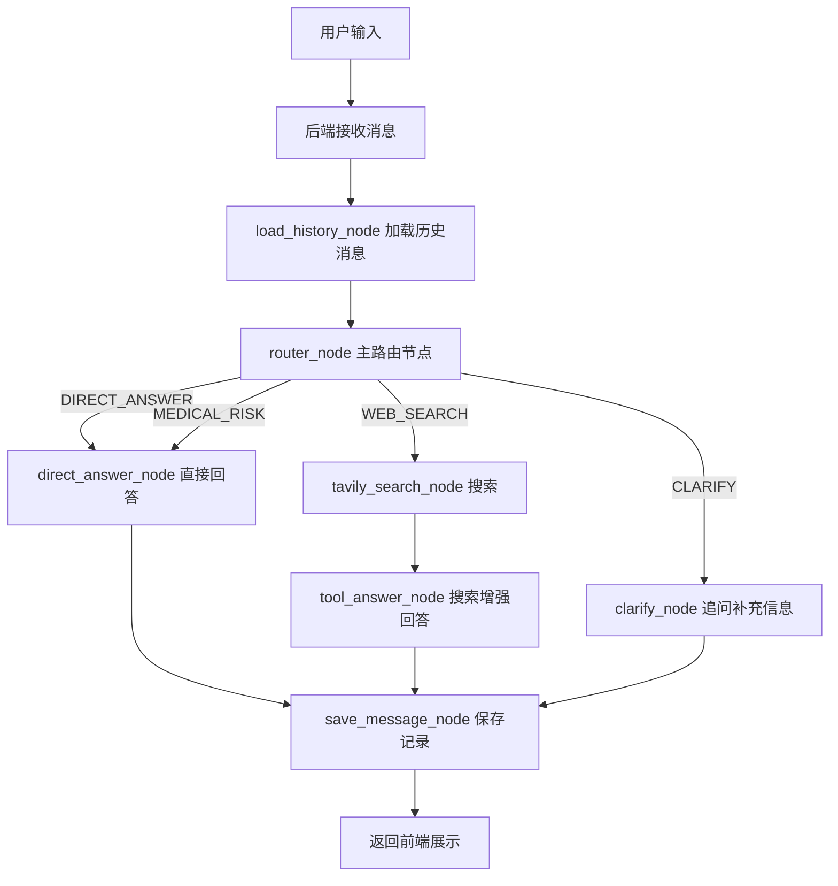

# 肤联智诊 文本知识问答与 LangGraph 多轮对话改造：需求与实施计划文档

> 版本：V1.0  
> 日期：2026-04-29  
> 适用模块：肤联智诊 文本知识问答 / 智能助手模块  
> 核心目标：将原有 mock 知识问答页面改造为支持真实模型调用、多轮对话、意图路由和 Tavily 实时搜索增强的智能问答功能。

---

## 1. 项目背景

当前 肤联智诊 项目中的“文本知识问答 / 智能助手”模块主要依赖前端 mock 数据，适合早期页面展示，但不具备真实智能问答能力。为了提升系统的实用性、展示效果和后续扩展能力，需要将该模块升级为真实的多轮对话系统。

本次改造不面向视觉问诊模块，也不做复杂多 Agent 系统，而是聚焦文本知识问答场景，采用轻量 LangGraph 工作流完成对话流程管理。

最终目标是实现：

```text
用户提问
  -> 后端接收消息
  -> 加载历史对话
  -> LangGraph 主路由节点判断问题类型
  -> 普通知识问题直接调用大模型回答
  -> 实时信息问题调用 Tavily 搜索后再回答
  -> 保存会话、消息和工具调用记录
  -> 前端展示回答、历史消息和搜索来源
```

---

## 2. 建设目标

### 2.1 总体目标

将原有“知识问答 mock 页面”改造为一个真实可用的多轮对话智能助手，支持：

1. 多轮上下文对话；
2. 大模型直接问答；
3. 意图识别与路由分发；
4. Tavily 实时信息搜索；
5. 搜索结果增强回答；
6. 会话与消息持久化；
7. 前端展示工具调用状态和搜索来源；
8. 后期通过修改模型名测试不同文本模型。

---

### 2.2 一句话方案

```text
轻量 LangGraph + 一个主文本模型 + Tavily 搜索工具 + 多轮会话入库
```

---

## 3. 需求范围

### 3.1 本模块需要实现的内容

| 模块 | 需求 |
|---|---|
| 前端页面 | 将 mock 问答界面改造成聊天式多轮对话界面 |
| 后端接口 | 新增会话创建、会话列表、消息发送、消息查询接口 |
| 多轮对话 | 基于 session_id 管理上下文 |
| 模型调用 | 后端调用配置的文本大模型生成回答 |
| LangGraph | 使用主路由节点管理对话分支 |
| 意图识别 | 判断是否直接回答、是否调用 Tavily、是否需要追问 |
| Tavily 搜索 | 对实时信息类问题调用 Tavily |
| 搜索增强回答 | 将搜索结果交给大模型整理后生成最终回答 |
| 数据持久化 | 保存会话、消息、工具调用记录 |
| 展示来源 | 前端展示 Tavily 返回的来源标题、摘要和链接 |
| 配置化模型 | 通过 `.env` 中的模型名切换不同模型 |

---

### 3.2 本项目暂不实现的内容

| 暂不实现内容 | 原因 |
|---|---|
| 多 Agent 协作 | 第一版复杂度过高，收益不明显 |
| 长期用户画像记忆 | 当前只需要会话级历史即可 |
| 自动多轮连续搜索 | 容易增加成本和不稳定性 |
| 前端直接调用 Tavily | 工具调用应放在后端，便于鉴权、日志和统一管理 |
| 多模型自动路由 | 当前一个主模型已足够 |
| 复杂医学诊断能力 | 系统只做健康科普与辅助建议，不替代医生诊断 |

---

## 4. 用户场景

### 4.1 普通知识问答

用户提问：

```text
湿疹是什么？
```

系统处理方式：

```text
不调用 Tavily
直接调用大模型回答
```

适用场景：

- 皮肤病基础知识；
- 护理建议；
- 常见症状解释；
- 日常健康科普。

---

### 4.2 多轮追问

用户连续提问：

```text
用户：湿疹是什么？
助手：湿疹是一类常见的炎症性皮肤问题……
用户：那它和过敏有什么关系？
```

系统处理方式：

```text
加载当前 session 历史消息
结合上下文理解“它”指湿疹
调用大模型回答
```

---

### 4.3 实时信息问答

用户提问：

```text
最近有没有湿疹治疗的新指南？
```

系统处理方式：

```text
router_node 判断为 WEB_SEARCH
调用 Tavily 搜索
将搜索结果交给大模型整理
返回最终回答和参考来源
```

---

### 4.4 系统功能问答

用户提问：

```text
我怎么上传皮肤图片？
```

系统处理方式：

```text
router_node 判断为 SYSTEM_HELP
直接根据系统功能说明回答
不调用 Tavily
```

---

### 4.5 医疗风险提醒

用户提问：

```text
皮肤破溃并且发热怎么办？
```

系统处理方式：

```text
router_node 判断为 MEDICAL_RISK
直接给出风险提醒和线下就医建议
不依赖 Tavily 搜索
```

---

## 5. 总体技术方案

### 5.1 技术选型

| 技术 | 用途 |
|---|---|
| LangGraph | 管理多轮对话流程、主节点路由和分支节点 |
| Qwen 文本模型 | 负责意图识别、直接回答和搜索增强回答 |
| Tavily | 实时信息搜索工具 |
| 后端服务 | 提供聊天接口、模型调用、工具调用和数据存储 |
| 数据库 | 保存会话、消息和工具调用日志 |
| 前端聊天页面 | 展示多轮对话、工具状态和搜索来源 |

---

### 5.2 推荐模型配置

第一版建议使用：

```env
TEXT_QA_MODEL=qwen3.6-flash
```

展示 / 答辩阶段建议使用：

```env
TEXT_QA_MODEL=qwen3.6-plus
```

答辩前如果希望版本稳定，可以使用固定版本：

```env
TEXT_QA_MODEL=qwen3.6-plus-2026-04-02
```

低成本备用模型：

```env
TEXT_QA_MODEL=qwen3.5-flash
```

---

### 5.3 推荐环境变量

```env
# 文本问答模型
TEXT_QA_MODEL=qwen3.6-flash

# 百炼 OpenAI 兼容接口
QWEN_API_KEY=your_dashscope_api_key
QWEN_BASE_URL=https://dashscope.aliyuncs.com/compatible-mode/v1

# Tavily
TAVILY_API_KEY=your_tavily_api_key
TAVILY_ENABLED=true

# 对话配置
CHAT_HISTORY_LIMIT=10
CHAT_TEMPERATURE=0.2
CHAT_MAX_TOKENS=1200
CHAT_TIMEOUT_SECONDS=30
```

---

## 6. LangGraph 工作流设计

### 6.1 总体流程



---

### 6.2 节点说明

| 节点 | 作用 |
|---|---|
| `load_history_node` | 根据 session_id 加载历史消息 |
| `router_node` | 判断用户意图并决定后续分支 |
| `direct_answer_node` | 对普通问题直接调用大模型回答 |
| `tavily_search_node` | 对实时问题调用 Tavily 搜索 |
| `tool_answer_node` | 结合 Tavily 搜索结果生成最终回答 |
| `clarify_node` | 信息不足时追问用户 |
| `save_message_node` | 保存用户消息、AI 回答和工具记录 |
| `safety_guard_node` | 医疗风险兜底提醒 |

---

### 6.3 State 设计

```python
from typing import TypedDict, Literal, List, Optional

class ChatState(TypedDict):
    session_id: int
    user_id: int
    user_message: str

    history: List[dict]

    intent: Optional[
        Literal[
            "DIRECT_ANSWER",
            "WEB_SEARCH",
            "CLARIFY",
            "SYSTEM_HELP",
            "MEDICAL_RISK"
        ]
    ]

    need_tavily: bool
    search_query: str

    tavily_results: List[dict]

    final_answer: str
    sources: List[dict]

    model_name: str
    used_tool: bool
    tool_name: Optional[str]
```

---

### 6.4 意图类型

| intent | 含义 | 是否调用 Tavily |
|---|---|---:|
| `DIRECT_ANSWER` | 普通皮肤健康科普、护理建议、常见问题 | 否 |
| `WEB_SEARCH` | 最新指南、医院、药品、政策、实时信息 | 是 |
| `CLARIFY` | 用户问题太短或信息不足，需要追问 | 否 |
| `MEDICAL_RISK` | 高风险症状，如破溃、发热、迅速扩散 | 通常否 |

---

### 6.5 路由规则

优先触发 Tavily 的关键词包括：

```text
最近、最新、现在、实时、附近、政策、新闻、指南、药品通报、价格、医院、发布、更新
```

不建议调用 Tavily 的问题包括：

```text
是什么、为什么、怎么护理、常见原因、注意事项、系统怎么用、如何上传图片
```

高风险症状直接走医疗风险提醒，不依赖搜索：

```text
发热、破溃、剧烈疼痛、迅速扩散、流脓、呼吸困难、严重过敏反应
```

---

## 7. Prompt 设计

### 7.1 Router Prompt

```text
你是 肤联智诊 的问答路由器。请判断用户问题应该如何处理。

你只能输出 JSON，不要输出 Markdown，不要解释。

可选 intent：
- DIRECT_ANSWER：普通皮肤健康科普、护理建议、常见问答
- WEB_SEARCH：最新信息、实时政策、医院、药品、指南更新
- CLARIFY：问题过于模糊，需要追问
- MEDICAL_RISK：疑似高风险症状，需要建议及时就医

输出格式：
{
  "intent": "DIRECT_ANSWER | WEB_SEARCH | CLARIFY | SYSTEM_HELP | MEDICAL_RISK",
  "need_tavily": true 或 false,
  "reason": "简短原因",
  "search_query": "如果需要搜索，给出中文搜索词；否则为空字符串"
}

规则：
1. 不要所有问题都调用 Tavily。
2. 普通知识问答不调用 Tavily。
3. 涉及“最近、最新、现在、附近、政策、药品通报、指南更新”等实时信息时，调用 Tavily。
4. 涉及严重症状，如发热、破溃、迅速扩散、剧烈疼痛，应标记为 MEDICAL_RISK。
5. 用户问题太短或缺少必要信息时，标记为 CLARIFY。
```

---

### 7.2 Direct Answer Prompt

```text
你是 肤联智诊 的皮肤健康问答助手。

请根据用户问题和历史对话，用中文回答。

要求：
1. 回答要清楚、克制、易懂。
2. 不要给出最终医学诊断。
3. 可以提供常见原因、护理建议、就医建议。
4. 如果出现严重症状，要建议及时线下就医。
5. 不要编造药品、医院、指南或最新政策。
6. 不要声称可以替代医生。
7. 结尾加一句简短免责声明。
```

---

### 7.3 Tool Answer Prompt

```text
你是 肤联智诊 的皮肤健康问答助手。

下面是 Tavily 搜索得到的公开信息摘要。请结合用户问题和搜索结果，用中文生成最终回答。

要求：
1. 不要逐字复制搜索结果。
2. 只总结和用户问题相关的信息。
3. 如果搜索结果不足以支持结论，要明确说明。
4. 不要给出最终医学诊断。
5. 涉及药物、治疗、指南时，要提醒用户咨询医生。
6. 回答末尾加免责声明。
7. 返回内容要适合前端直接展示。
```

---

## 8. 后端接口设计

### 8.1 创建会话

```http
POST /api/v1/chat/sessions
```

请求示例：

```json
{
  "title": "皮肤护理咨询"
}
```

返回示例：

```json
{
  "session_id": 10001,
  "title": "皮肤护理咨询",
  "created_at": "2026-04-29 10:00:00"
}
```

---

### 8.2 获取会话列表

```http
GET /api/v1/chat/sessions
```

返回示例：

```json
{
  "items": [
    {
      "session_id": 10001,
      "title": "皮肤护理咨询",
      "last_message": "湿疹是什么？",
      "updated_at": "2026-04-29 10:00:05"
    }
  ]
}
```

---

### 8.3 获取会话消息

```http
GET /api/v1/chat/sessions/{session_id}/messages
```

返回示例：

```json
{
  "session_id": 10001,
  "messages": [
    {
      "role": "user",
      "content": "湿疹是什么？",
      "created_at": "2026-04-29 10:00:00"
    },
    {
      "role": "assistant",
      "content": "湿疹是一类常见的炎症性皮肤问题……",
      "created_at": "2026-04-29 10:00:05",
      "used_tool": false,
      "sources": []
    }
  ]
}
```

---

### 8.4 发送消息

```http
POST /api/v1/chat/sessions/{session_id}/messages
```

请求示例：

```json
{
  "message": "最近有没有关于湿疹治疗的新指南？"
}
```

返回示例：

```json
{
  "message_id": 20001,
  "answer": "根据公开资料整理，湿疹治疗通常包括基础保湿、避免刺激因素、必要时使用外用药物等。若症状持续加重，建议及时就医。",
  "intent": "WEB_SEARCH",
  "used_tool": true,
  "tool_name": "tavily",
  "sources": [
    {
      "title": "来源标题",
      "url": "https://example.com",
      "summary": "来源摘要"
    }
  ],
  "created_at": "2026-04-29 10:01:00"
}
```

---

## 9. 数据库设计

### 9.1 chat_session 表

| 字段 | 类型 | 说明 |
|---|---|---|
| `id` | int | 主键 |
| `user_id` | int | 用户 ID |
| `title` | varchar | 会话标题 |
| `created_at` | datetime | 创建时间 |
| `updated_at` | datetime | 更新时间 |

---

### 9.2 chat_message 表

| 字段 | 类型 | 说明 |
|---|---|---|
| `id` | int | 主键 |
| `session_id` | int | 会话 ID |
| `user_id` | int | 用户 ID |
| `role` | varchar | `user` / `assistant` / `tool` |
| `content` | text | 消息内容 |
| `intent` | varchar | 意图类型 |
| `used_tool` | boolean | 是否使用工具 |
| `tool_name` | varchar | 工具名称 |
| `sources_json` | text | 搜索来源 JSON |
| `model_name` | varchar | 使用模型 |
| `created_at` | datetime | 创建时间 |

---

### 9.3 tool_call_log 表

| 字段 | 类型 | 说明 |
|---|---|---|
| `id` | int | 主键 |
| `session_id` | int | 会话 ID |
| `message_id` | int | 消息 ID |
| `tool_name` | varchar | 工具名，如 Tavily |
| `query` | text | 搜索 query |
| `result_json` | text | 搜索结果 |
| `latency_ms` | int | 工具耗时 |
| `success` | boolean | 是否成功 |
| `error_message` | text | 错误信息 |
| `created_at` | datetime | 创建时间 |

---

## 10. 前端改造方案

### 10.1 页面结构

| 区域 | 功能 |
|---|---|
| 左侧会话栏 | 新建会话、历史会话列表、切换会话 |
| 中间聊天区 | 展示用户消息、AI 回答、工具调用结果 |
| 底部输入区 | 输入问题、发送按钮、清空输入 |
| 来源展示区 | 当 used_tool=true 时展示 Tavily 来源 |
| 状态提示区 | 展示正在思考、正在搜索、正在整理回答等状态 |

---

### 10.2 替换原 mock 逻辑

| 原逻辑 | 改造后逻辑 |
|---|---|
| 本地 mock 消息 | 调用 `GET /api/v1/chat/sessions/{session_id}/messages` |
| 本地追加用户消息 | 发送请求到 `POST /api/v1/chat/sessions/{session_id}/messages` |
| 本地写死 AI 回复 | 后端 LangGraph 返回真实回答 |
| 本地假搜索来源 | 后端返回 Tavily sources |
| 无上下文 | 后端按 session_id 加载历史消息 |
| 无工具状态 | 根据返回字段展示 `used_tool` 和 `tool_name` |

---

### 10.3 前端状态设计

| 状态 | 展示文案 |
|---|---|
| `idle` | 正常输入 |
| `thinking` | 正在思考中…… |
| `routing` | 正在判断问题类型…… |
| `searching` | 正在联网搜索相关资料…… |
| `answering` | 正在整理回答…… |
| `error` | 暂时无法生成回答，请稍后重试 |

---

### 10.4 消息展示格式

#### 未调用 Tavily

```text
AI 回答内容
```

#### 调用 Tavily

```text
AI 回答内容

参考来源：
1. 来源标题
2. 来源标题
3. 来源标题
```

前端只展示来源标题、摘要和链接，不展示过长原文。

---

## 11. 实现计划

### 跑通真实模型问答

目标：前端不再使用 mock，用户可以真实调用模型进行多轮问答。

任务：

1. 新增 `chat_session` 表；
2. 新增 `chat_message` 表；
3. 新增创建会话接口；
4. 新增获取会话列表接口；
5. 新增获取会话消息接口；
6. 新增发送消息接口；
7. 接入 `TEXT_QA_MODEL=qwen3.6-flash`；
8. 前端替换 mock 数据源；
9. 实现基础多轮消息展示。

验收标准：

1. 用户可以创建新会话；
2. 用户可以连续提问；
3. 刷新页面后历史消息仍存在；
4. 回答来自真实模型；
5. 前端不再依赖本地写死回答。

### 加入 LangGraph 路由

目标：让系统能够判断问题类型，并根据意图进入不同分支。

任务：

1. 新增 `ChatState`；
2. 新增 `load_history_node`；
3. 新增 `router_node`；
4. 要求 router 输出固定 JSON；
5. 新增条件边；
6. 保存每轮 `intent`、`used_tool`、`model_name`；
7. 增加 JSON 解析失败兜底逻辑。

验收标准：

1. 普通知识问题走 `DIRECT_ANSWER`；
2. 系统功能问题走 `SYSTEM_HELP`；
3. 最新信息问题走 `WEB_SEARCH`；
4. 高风险问题走 `MEDICAL_RISK`；
5. 路由结果可以在日志或数据库中查看。

### 接入 Tavily 搜索

目标：对实时信息类问题，系统可以联网搜索后回答。

任务：

1. 配置 `TAVILY_API_KEY`；
2. 新增 `tavily_search_node`；
3. 新增 `tool_answer_node`；
4. 新增 `tool_call_log` 表；
5. 搜索结果只保留前 3～5 条；
6. 将搜索结果交给模型生成最终回答；
7. 前端展示 sources 来源。

验收标准：

1. “最近 / 最新 / 附近 / 政策 / 指南”等问题能够触发 Tavily；
2. 回答中能够体现搜索结果；
3. 前端可以展示来源；
4. Tavily 失败时系统不会崩溃；
5. 工具调用记录可查。

---

## 12. 验收测试用例

### 12.1 普通知识问答

输入：

```text
湿疹是什么？
```

预期：

```text
intent = DIRECT_ANSWER
used_tool = false
```

---

### 12.2 多轮追问

输入：

```text
第一轮：湿疹是什么？
第二轮：那它和过敏有什么关系？
```

预期：

```text
系统能够理解“它”指湿疹
不调用 Tavily
结合历史消息回答
```

---

### 12.3 实时搜索问题

输入：

```text
最近有没有湿疹治疗的新指南？
```

预期：

```text
intent = WEB_SEARCH
used_tool = true
tool_name = tavily
sources 不为空
```

---

### 12.4 系统功能问题

输入：

```text
我怎么上传皮肤图片？
```

预期：

```text
intent = SYSTEM_HELP
used_tool = false
```

---

### 12.5 医疗风险问题

输入：

```text
皮肤破溃并且发热怎么办？
```

预期：

```text
intent = MEDICAL_RISK
used_tool = false
回答中提示及时线下就医
```

---

### 12.6 Tavily 失败兜底

输入：

```text
最近有没有某某药膏的不良反应通报？
```

模拟：

```text
Tavily API 调用失败
```

预期：

```text
系统不崩溃
前端显示可理解的错误提示或降级回答
后端记录 error_message
```


## 14. 推荐开发顺序

优先级从高到低：

1. 后端真实模型问答接口；
2. 会话和消息入库；
3. 前端替换 mock 数据；
4. LangGraph 路由；
5. Tavily 搜索；
6. 来源展示；
7. 工具日志；
8. 错误兜底；

